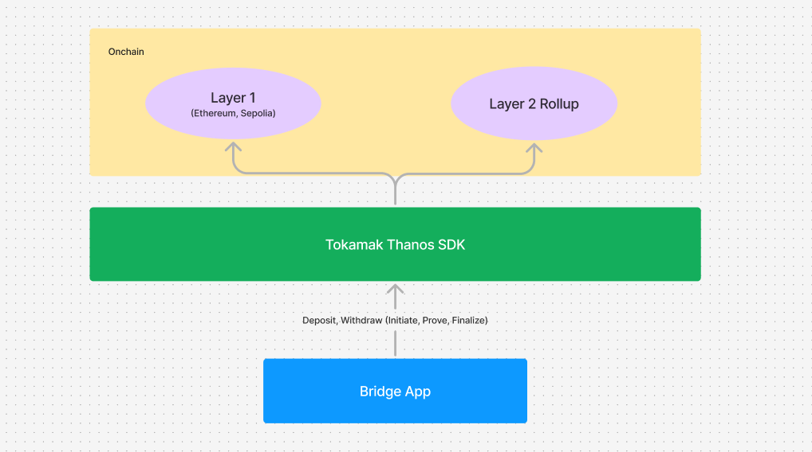

# Thanos bridge

This is a DApp which interacts with the Thanos chain where the users can bridge their assets to from Layer 1 (Ethereum or Sepolia) to the Thanos chain which is a Layer 2 rollup that can be deployed on Tokamak Rollup Hub.

## Features

- Deposit assets from Layer 1 to the Thanos chain
- Withdraw assets from the Thanos chain to Layer 1
- Tokens supported: ETH, L2 Native Token, USDT, USDC
- After the withdrawal initiated, the user get a transaction detail downloaded so the Tx Hash can be used for prove and finalize process.

## Tech stacks used

- [Next.js v14.2.11](https://nextjs.org/docs/14/app/building-your-application)
- [TypeScript](https://www.typescriptlang.org/docs/)
- [Chakra UI ^3.2.1](https://www.chakra-ui.com/docs/get-started/installation)
- [Wagmi ^2.13.3](https://wagmi.sh/react/getting-started)
- [Tokamak Thanos SDK ^0.0.14](https://www.npmjs.com/package/@tokamak-network/thanos-sdk)
- [Jotai ^2.10.3](https://jotai.org/docs)

## Local Hosting

### Prerequisites

1. Node.js v18.17.0+
2. npm v10+

### Steps

1. Clone the repository
2. Copy `.env.example` to `.env` and fill in the values
3. Run `yarn install`
4. Run `yarn dev`
5. Open [http://localhost:3000](http://localhost:3000) in your browser

### Environment Variables

| Variable Name                                   | Description                                                 |
| ----------------------------------------------- | ----------------------------------------------------------- |
| `NEXT_PUBLIC_L1_CHAIN_NAME`                     | The name of the L1 chain (e.g. "Sepolia")                   |
| `NEXT_PUBLIC_L1_CHAIN_ID`                       | The chain ID of the L1 chain (e.g. 11155111)                |
| `NEXT_PUBLIC_L1_RPC`                            | The RPC URL of the L1 chain                                 |
| `NEXT_PUBLIC_L1_NATIVE_CURRENCY_NAME`           | The name of the L1 native currency (e.g. "Sepolia Ether")   |
| `NEXT_PUBLIC_L1_NATIVE_CURRENCY_SYMBOL`         | The symbol of the L1 native currency (e.g. "ETH")           |
| `NEXT_PUBLIC_L1_NATIVE_CURRENCY_DECIMALS`       | The number of decimals for the L1 native currency (e.g. 18) |
| `NEXT_PUBLIC_L1_BLOCK_EXPLORER`                 | The block explorer URL for the L1 chain                     |
| `NEXT_PUBLIC_L2_CHAIN_NAME`                     | The name of the L2 chain (e.g. "Thanos Sep")                |
| `NEXT_PUBLIC_L2_CHAIN_ID`                       | The chain ID of the L2 chain (e.g. 1237345)                 |
| `NEXT_PUBLIC_L2_RPC`                            | The RPC URL of the L2 chain                                 |
| `NEXT_PUBLIC_L2_NATIVE_CURRENCY_NAME`           | The name of the L2 native currency (e.g. "TON")             |
| `NEXT_PUBLIC_L2_NATIVE_CURRENCY_SYMBOL`         | The symbol of the L2 native currency (e.g. "TON")           |
| `NEXT_PUBLIC_L2_NATIVE_CURRENCY_DECIMALS`       | The number of decimals for the L2 native currency (e.g. 18) |
| `NEXT_PUBLIC_L2_BLOCK_EXPLORER`                 | The block explorer URL for the L2 chain                     |
| `NEXT_PUBLIC_NATIVE_TOKEN_L1_ADDRESS`           | The L1 address of the native token                          |
| `NEXT_PUBLIC_L1_USDC_ADDRESS`                   | The L1 address of USDC                                      |
| `NEXT_PUBLIC_L1_USDT_ADDRESS`                   | The L1 address of USDT                                      |
| `NEXT_PUBLIC_L2_USDT_ADDRESS`                   | The L2 address of USDT                                      |
| `NEXT_PUBLIC_STANDARD_BRIDGE_ADDRESS`           | The address of the standard bridge contract                 |
| `NEXT_PUBLIC_ADDRESS_MANAGER_ADDRESS`           | The address of the address manager contract                 |
| `NEXT_PUBLIC_L1_CROSS_DOMAIN_MESSENGER_ADDRESS` | The address of the L1 cross domain messenger contract       |
| `NEXT_PUBLIC_OPTIMISM_PORTAL_ADDRESS`           | The address of the optimism portal contract                 |
| `NEXT_PUBLIC_L2_OUTPUT_ORACLE_ADDRESS`          | The address of the L2 output oracle contract                |
| `NEXT_PUBLIC_L1_USDC_BRIDGE_ADDRESS`            | The address of the L1 USDC bridge contract                  |
| `NEXT_PUBLIC_DISPUTE_GAME_FACTORY_ADDRESS`      | The address of the dispute game factory contract            |

## High level architecture

## Code Diagram

[Code Diagram](./thanos-bridge.codediagram)

## Deployment

Once the PR is merged to the `main` branch, the docker image is being pushed to [docker hub](https://hub.docker.com/repository/docker/tokamaknetwork/trh-op-bridge-app).
